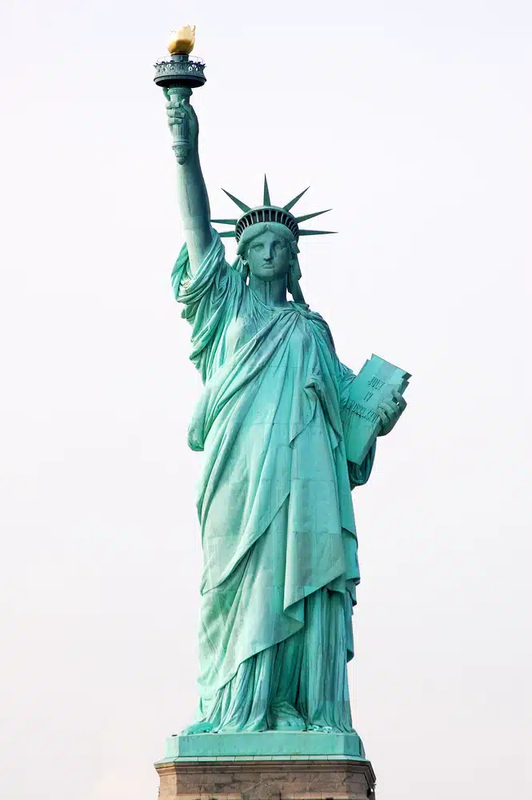
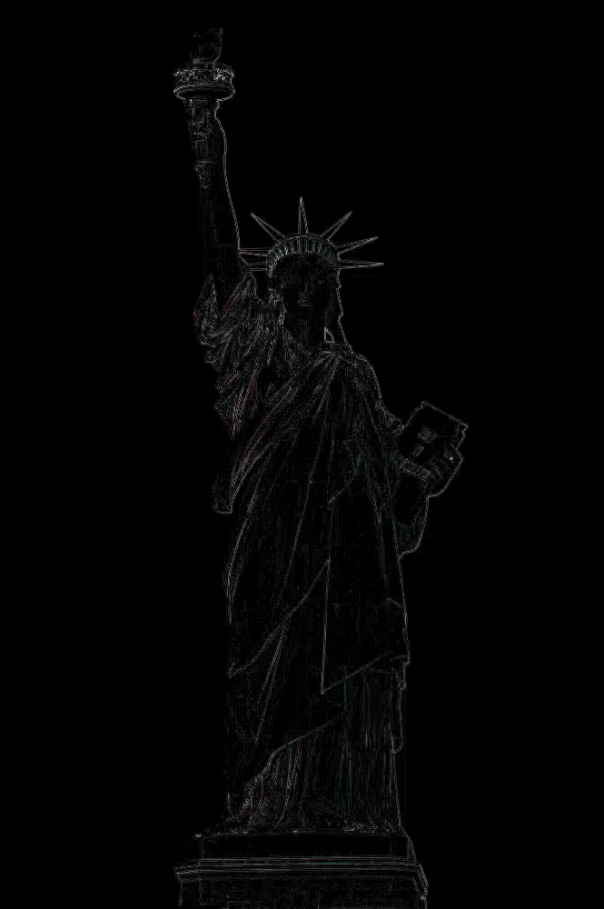
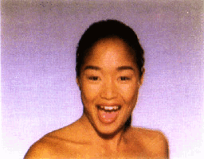

# computer-graphics
# Image Processing Toolkit (C++)

## Overview
This project implements a **mini Photoshop/GIMP** in C++, supporting a wide range of filters and transformations.  
From simple brightness adjustments to advanced morphing, the program demonstrates **computer graphics algorithms**, **linear algebra in practice**, and **systems-level programming in C++**.  

I developed this project as part of JHU’s Computer Graphics course, but I approached it as if I were building a standalone image library.  

---

## Features
- **Core Filters**
  - Brightness / Contrast adjustment
  - Luminance (grayscale)
  - Saturation changes
  - Additive noise injection
  - Cropping & quantization  

- **Dithering & Sampling**
  - Random dithering
  - Ordered dithering (2×2)
  - Floyd–Steinberg error diffusion
  - Nearest / Bilinear / Gaussian sampling  

- **Geometric Transforms**
  - Scaling (nearest, bilinear, Gaussian)
  - Rotation (nearest, bilinear, Gaussian)  

- **Advanced Effects**
  - Edge detection (3×3 kernels)
  - Gaussian blur
  - Fun warp filters (fisheye, swirl, bulge)
  - Beier–Neely morphing (feature-based image metamorphosis)  

---

## Technical Highlights
- Implemented in **C++** with manual memory management for pixel buffers  
- Built with **Makefiles** for Unix-like systems  
- Designed a **modular filter pipeline** with composable operations  
- Applied:
  - **Barycentric coordinates** for interpolation  
  - **Affine transformations** for geometric warping  
  - **Gaussian kernels** for smoothing and sampling  

---

## Usage
To see available filters:
```bash
./Assignment1
```
Example 1: Brighten by 10%
```
./Assignment1 --brighten 1.1 --in input.bmp --out output.bmp
```

Example 2: Grayscale + Edge Detection
```
./Assignment1 --luminance 1 --edgeDetect3x3 1 --in input.jpg --out edges.jpg
```

Example 3: Rotate with Bilinear Sampling
```
./Assignment1 --rotateBilinear 45 --in input.bmp --out rotated.bmp
```

---

## 🎨 Example Outputs

### Input vs. Swirl
| Original | Swirl |
|----------|-------|
|  |  |

### Input vs. Edge Detection
| Original | Edge Detect |
|----------|-------|
|  |  |

### Morphing Demo (Michael Jackson Inspiration)

This project implements **Beier–Neely morphing**, the classic line-segment–based algorithm behind Michael Jackson’s *Black or White* (1991) music video- one of the first landmark uses of digital morphing in entertainment. I recreated the effect by smoothly transforming a portrait of a girl into a portrait of a boy, demonstrating warping, cross-dissolving, and practical graphics pipeline design.



---

## 💡 Skills Gained
- Built a **graphics pipeline** from scratch  
- Implemented **classic image processing algorithms**  
- Strengthened **C++ debugging, memory handling, and performance awareness**  
- Gained hands-on experience with **linear algebra in graphics**  
- Practiced **modular design** for extensible filters  

---

## 🔮 Future Extensions
- GUI for interactive editing  
- Export to video formats (`.mp4`) instead of GIF  
- Automatic feature detection with **OpenCV**  
- Multithreaded filters with **OpenMP** for speed  

---

## 🧑‍💻 Why This Project Matters
This project highlights my ability to:
- Translate **theory into practice** (graphics, linear algebra, algorithms)  
- Work at the **systems level** (manual memory, Makefiles, debugging pipelines)  
- Produce **visual, verifiable results** that showcase both technical skill and creativity  

